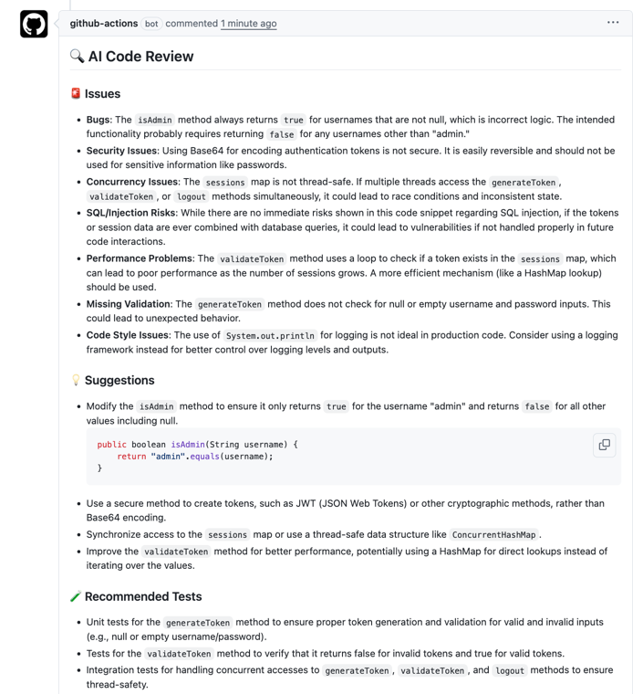

# ⚡ AI Pull Request Reviewer Bot

A **serverless, GitHub Actions–powered AI bot** that automatically reviews your pull requests.  
It detects **bugs, security issues, performance problems, missing tests, and style violations**, then posts detailed comments on the PR.

This project demonstrates **CI/CD automation, Python scripting, GitHub Actions, and AI integration** in a production-grade workflow.

---

## 🚀 Features

- Automatic code review on **every Pull Request**
- Detects:
    - Logic bugs
    - Security vulnerabilities
    - Performance issues
    - Code style violations
    - Missing unit tests
- Posts **rich markdown comments** on the PR
- Fully **serverless** — runs entirely on GitHub Actions
- Multi-language support (Java, Python, JavaScript, etc.)
- Easily extendable with:
    - Security scanning (Trivy, Semgrep)
    - Test coverage suggestions
    - Merge blocking for critical issues

---

## 🛠️ Technology Stack

- **GitHub Actions**: CI/CD automation
- **Python**: Core AI review script (`ai-reviewer.py`)
- **OpenAI GPT-4o-mini**: AI-powered code analysis
- **GitHub REST API & `peter-evans/create-or-update-comment`**: Post PR comments automatically

Optional enhancements:
- Trivy for Docker image vulnerability scanning
- SpotBugs for static Java analysis
- Checkstyle for code formatting

---

Sample PR Comment:

